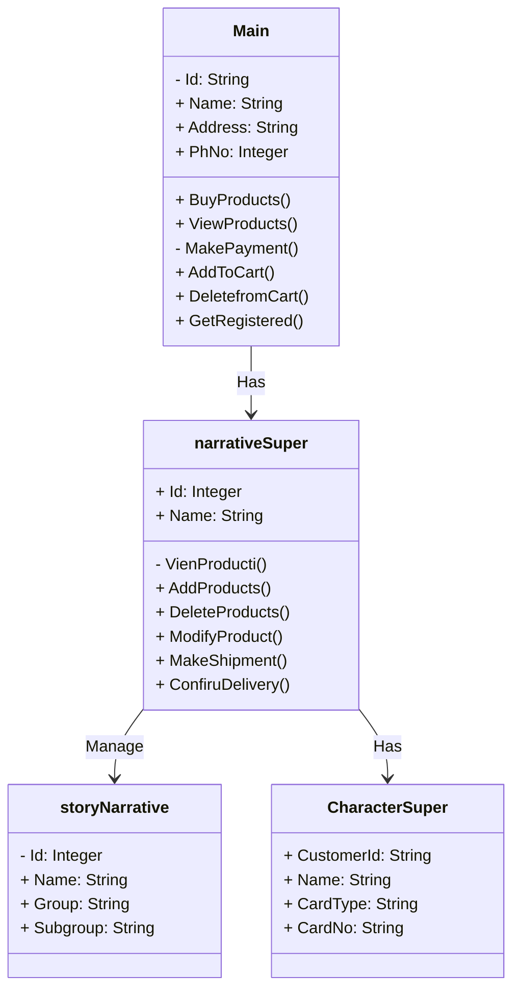

# Project Group 5 Video Game Read-Me

# How to Compile
This game can be compiled with the following compilers:
* clang
* g++

# Compatable OSes
This game is compatible with both Windows and MacOS

# System Requirements
This game is able to be run on any system capable of running C++

# Library Requirements
This game currently uses the Standard C++ Library

graph TD
    A(Start) --> B(Character Selection)
    B --> C{Ranger}
    B --> D{Swordsman}
    B --> E{Wizard}
    B --> F{Guardian}
    
    C --> G(Village)
    D --> G
    E --> G
    F --> G
    
    G --> H(Forest)
    H --> I(Castle)
    
    I --> J(End Game)

#Logical View

