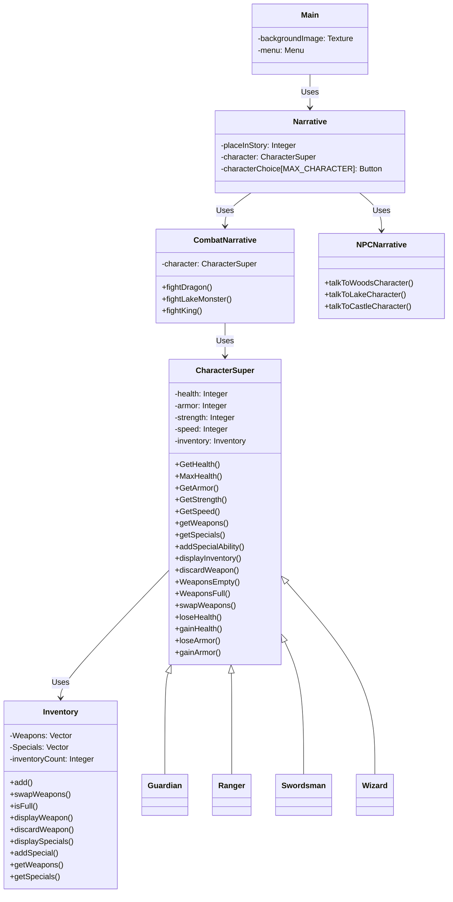
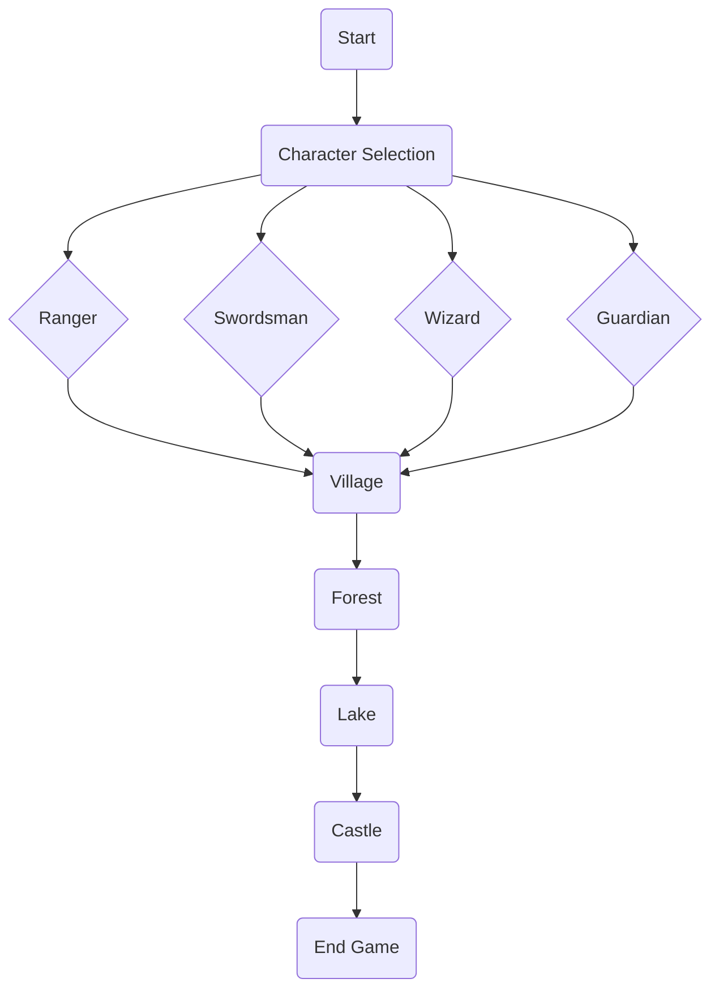

# Project Group 5: Choose Your Adventure Game

## Project Overview
This project is a version of a Choose Your Own Adventure game. In this game, the king of the land has begun using his power for evil. He allows monsters to roam, pillaging and burning as they please. The main character of this story is embarking on a journey to confront the king in the hopes of changing the situation. This is an arduous journey that involves interactions with strangers, battles, and more on the way to the king.

The player of the game is given four options of character types to play as: the wizard, the ranger, the swordsman, or the guardian. The game provides the player with multiple options to choose from throughout the game, which change the course of the game. 

## Compiling and Running the Program
### How to Compile:
In order to compile the game, ensure you have `g++` installed on your system.

To compile the program, run the following command:
`make`
If this command produces an error, use the following command:
 'g++ main.cpp -I/opt/homebrew/Cellar/sfml/2.6.1/include -o main -L/opt/homebrew/Cellar/sfml/2.6.1/lib -lsfml-graphics -lsfml-window -lsfml-system'

### How to Run:
After compiling the program, use the following command to execute the game:
`./main`

## Compatable OSes
This game has only been run and tested on MacOS systems.

## System Requirements
This game requires a system that is capable of running C++ and SFML.

## Library Requirements
* Standard C++ library
* The Simple and Fast Multimedia Library (SFML)

## Logical View



## Process View


## Use Case 

```mermaid
graph TD
  A(user) --> B(selects character)
  B --> C(story narrative)

    A->>B: Selects character
    B->>C: Story narrative
    activate C

    A->>F: Enters choice
    F->>C: Choice processed
    deactivate C

    G->>H: Switch narrative
    F->>D: NPC narrative (optional)
    F->>E: Combat narrative (optional)
    activate D
    activate E

    D->>H: NPC response
    E->>H: Combat outcome
    deactivate D
    deactivate E

```
