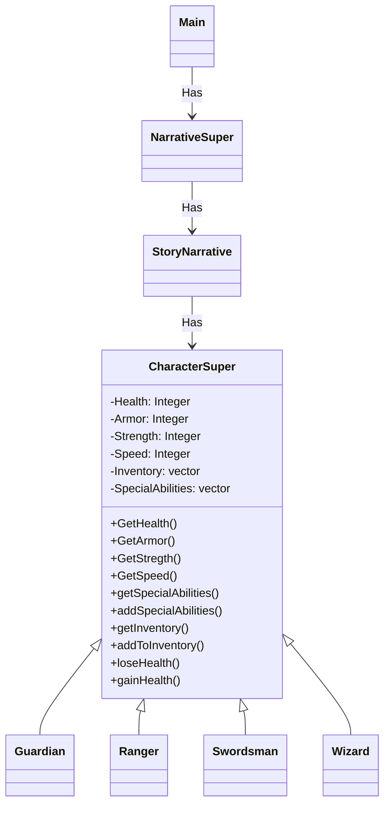
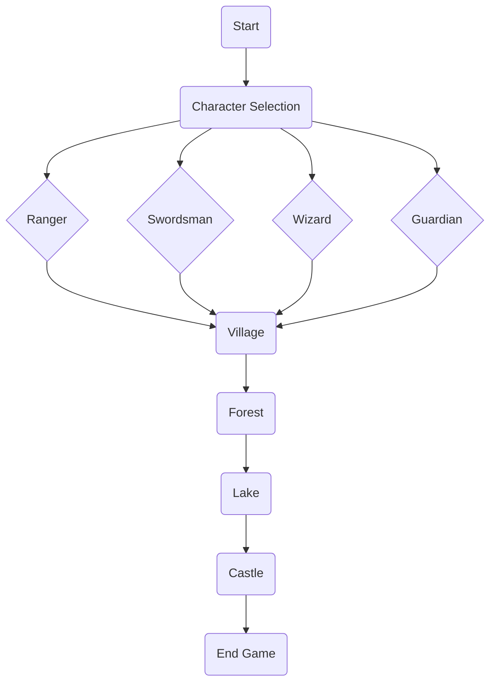

# Project Group 5 Video Game Read-Me

# How to Compile
This game can be compiled with the following compilers:
* clang
* g++

# Compatable OSes
This game is compatible with both Windows and MacOS

# System Requirements
This game is able to be run on any system capable of running C++

# Library Requirements
This game currently uses the Standard C++ Library

# Logical View



# Process View


# Use Case 
```mermaid
graph UC
  A(user) --> B(selects character)
  B --> C(story narrative)

  A --> F(enters choice)
  F --> C

  G --> H(switch narrative)
  F --> D(npc narrative)
  F --> E(combat narrative)

  D --> H
  E --> H
```
