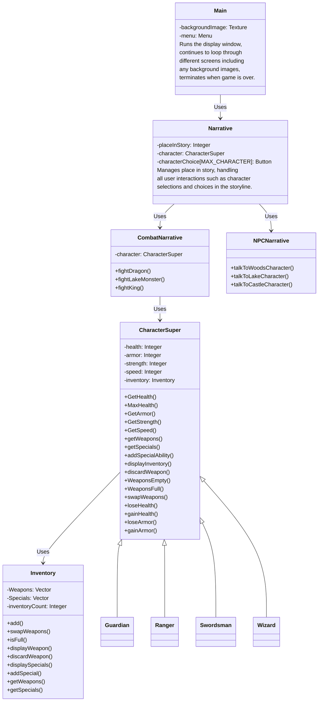

# Project Group 5: Choose Your Adventure Game

## Project Overview
The goal of this project is to develop a version of a Choose Your Own Adventure game. The storyline takes you through various scenarios, such as: interacting with strangers, fighting monsters, and ending with the ultimate goal of confronting the king of the village.

The game provides the player with multiple options to choose from, providing the ability of negatively or positively impacting the gameplay and leading to various outcomes.

## Compiling and Running the Program
### How to Compile:
In order to compile the game, ensure you have `clang` or `g++` installed on your system.

To compile the program, run the following command:
`* make`

### How to Run:
After compiling the program, use the following command to execute the game:
`* ./main`

## Compatable OSes
As of currently, this game has only been run and tested on MacOS systems.

## System Requirements
This game is able to be run on any system capable of running C++.

## Library Requirements
This game uses the standard C++ library, along with:
* The Simple and Fast Multimedia Library (SFML)
* In order to run this game, you must ensure you have SFML downloaded on your system. To install SFML, use this link: https://www.sfml-dev.org/download.php

## Logical View



## Process View


## Use Case 

```mermaid
graph TD
  A(user) --> B(selects character)
  B --> C(story narrative)

    A->>B: Selects character
    B->>C: Story narrative
    activate C

    A->>F: Enters choice
    F->>C: Choice processed
    deactivate C

    G->>H: Switch narrative
    F->>D: NPC narrative (optional)
    F->>E: Combat narrative (optional)
    activate D
    activate E

    D->>H: NPC response
    E->>H: Combat outcome
    deactivate D
    deactivate E

```
